# Technical Architecture Documentation

This document provides detailed technical architecture documentation for the P-System Membrane Computing Dev Container Features implementation.

## 📋 Table of Contents

- [System Overview](#system-overview)
- [Membrane Computing Fundamentals](#membrane-computing-fundamentals)
- [Container-Membrane Mapping](#container-membrane-mapping)
- [Component Architecture](#component-architecture)
- [Communication Protocols](#communication-protocols)
- [Evolution Engine](#evolution-engine)
- [Orchestration System](#orchestration-system)
- [Integration Patterns](#integration-patterns)
- [Performance & Scalability](#performance--scalability)
- [Security Model](#security-model)

## 🔭 System Overview

The P-System Membrane Computing implementation transforms container environments into computational membranes, creating a distributed computing framework based on biological membrane computing principles.

### High-Level Architecture


## 🧬 Membrane Computing Fundamentals

### P-System Mathematical Model

In formal terms, a P-System is defined as:

```
Π = (V, T, μ, w₁, w₂, ..., wₘ, R₁, R₂, ..., Rₘ, i₀)
```

Where:
- **V**: Alphabet of symbols
- **T**: Terminal alphabet (output symbols)
- **μ**: Membrane structure (tree hierarchy)
- **wᵢ**: Initial multiset in membrane i
- **Rᵢ**: Evolution rules for membrane i
- **i₀**: Output membrane designation

### Container Implementation Mapping


## 🗂️ Container-Membrane Mapping

### Membrane Lifecycle


### Container Resource Mapping


## 🏗️ Component Architecture

### Membrane Core Components

#### 1. Evolution Engine


#### 2. Communication Manager


#### 3. State Monitor


## 📡 Communication Protocols

### Message Structure

```json
{
  "messageId": "uuid-v4",
  "timestamp": "2024-01-01T12:00:00Z",
  "sender": {
    "membraneId": "cognitive-root",
    "containerId": "container-123"
  },
  "receiver": {
    "membraneId": "perception",
    "containerId": "container-456"
  },
  "messageType": "evolution_trigger|state_update|command|response",
  "priority": "high|medium|low",
  "payload": {
    "action": "process_image",
    "data": { ... },
    "metadata": { ... }
  },
  "routing": {
    "path": ["cognitive-root", "perception"],
    "ttl": 300,
    "retryCount": 0
  }
}
```

### Communication Modes


### Routing Algorithm

```python
def route_message(message, membrane_hierarchy):
    """
    Route message through membrane hierarchy
    """
    sender = message.sender.membrane_id
    receiver = message.receiver.membrane_id
    
    # Find common ancestor
    sender_path = get_path_to_root(sender, membrane_hierarchy)
    receiver_path = get_path_to_root(receiver, membrane_hierarchy)
    
    common_ancestor = find_common_ancestor(sender_path, receiver_path)
    
    # Route up to common ancestor, then down to receiver
    route = []
    
    # Up phase: sender to common ancestor
    for membrane in reversed(sender_path[:sender_path.index(common_ancestor)]):
        route.append(membrane)
    
    # Add common ancestor
    route.append(common_ancestor)
    
    # Down phase: common ancestor to receiver
    receiver_descent = receiver_path[receiver_path.index(common_ancestor)+1:]
    route.extend(receiver_descent)
    
    return route
```

## ⚙️ Evolution Engine

### Rule Definition Language

Evolution rules are defined using a declarative syntax:

```scheme
;; File system evolution rule
(define-evolution-rule "file-processor"
  :trigger (file-created "/opt/membrane/inbox/*.json")
  :condition (lambda (event) 
               (> (file-size (event-file event)) 0))
  :action (lambda (event)
            (let ((data (parse-json (event-file event))))
              (send-message "processor" data)
              (log-activity "file-processed" (event-file event))))
  :priority high)

;; Network evolution rule  
(define-evolution-rule "message-responder"
  :trigger (message-received "process-request")
  :condition (lambda (message)
               (valid-request? (message-payload message)))
  :action (lambda (message)
            (let ((result (process-request (message-payload message))))
              (reply-to-sender message result)))
  :priority medium)

;; Timer evolution rule
(define-evolution-rule "heartbeat"
  :trigger (timer-expired "heartbeat" 30) ; 30 seconds
  :condition (lambda (timer)
               (membrane-active?))
  :action (lambda (timer)
            (send-status-update)
            (restart-timer "heartbeat" 30))
  :priority low)
```

### Rule Execution Engine


### Rule Priority & Scheduling


## 🎼 Orchestration System

### Docker Compose Generation

The orchestrator generates Docker Compose configurations from membrane hierarchy definitions:

```yaml
# Generated docker-compose.yml
version: '3.8'

services:
  cognitive-root:
    image: mcr.microsoft.com/devcontainers/base:ubuntu
    container_name: membrane-cognitive-root
    environment:
      - MEMBRANE_ID=cognitive-root
      - PARENT_MEMBRANE=
      - ENABLE_SCHEME=true
      - ENABLE_MONITORING=true
    volumes:
      - membrane-comm:/opt/membrane/communication
      - membrane-state:/opt/membrane/state
    networks:
      - membrane-net
    depends_on:
      - membrane-registry

  perception:
    image: mcr.microsoft.com/devcontainers/base:ubuntu
    container_name: membrane-perception
    environment:
      - MEMBRANE_ID=perception
      - PARENT_MEMBRANE=cognitive-root
      - ENABLE_SCHEME=true
    volumes:
      - membrane-comm:/opt/membrane/communication:ro
      - perception-state:/opt/membrane/state
    networks:
      - membrane-net
    depends_on:
      - cognitive-root

  visual-worker:
    image: mcr.microsoft.com/devcontainers/base:ubuntu
    container_name: membrane-visual-worker
    environment:
      - MEMBRANE_ID=visual-worker
      - PARENT_MEMBRANE=perception
      - ENABLE_SCHEME=false
    volumes:
      - membrane-comm:/opt/membrane/communication:ro
      - visual-data:/opt/membrane/data
    networks:
      - membrane-net
    depends_on:
      - perception
    deploy:
      replicas: 2
      resources:
        limits:
          memory: 512M
        reservations:
          memory: 256M

volumes:
  membrane-comm:
  membrane-state:
  perception-state:
  visual-data:

networks:
  membrane-net:
    driver: bridge
```

### Kubernetes Deployment

```yaml
# Generated kubernetes deployment
apiVersion: apps/v1
kind: Deployment
metadata:
  name: cognitive-root
  labels:
    app: membrane
    membrane-id: cognitive-root
spec:
  replicas: 1
  selector:
    matchLabels:
      app: membrane
      membrane-id: cognitive-root
  template:
    metadata:
      labels:
        app: membrane
        membrane-id: cognitive-root
    spec:
      containers:
      - name: membrane
        image: mcr.microsoft.com/devcontainers/base:ubuntu
        env:
        - name: MEMBRANE_ID
          value: "cognitive-root"
        - name: ENABLE_SCHEME
          value: "true"
        volumeMounts:
        - name: membrane-comm
          mountPath: /opt/membrane/communication
        - name: membrane-state
          mountPath: /opt/membrane/state
        resources:
          limits:
            memory: "1Gi"
            cpu: "500m"
          requests:
            memory: "512Mi"
            cpu: "250m"
      volumes:
      - name: membrane-comm
        persistentVolumeClaim:
          claimName: membrane-comm-pvc
      - name: membrane-state
        persistentVolumeClaim:
          claimName: membrane-state-pvc
---
apiVersion: v1
kind: Service
metadata:
  name: cognitive-root-service
spec:
  selector:
    app: membrane
    membrane-id: cognitive-root
  ports:
  - port: 8080
    targetPort: 8080
  type: ClusterIP
```

### Auto-scaling Logic


## 🔗 Integration Patterns

### ggml Tensor Integration


### OpenCog AtomSpace Integration

```scheme
;; Membrane to AtomSpace mapping
(use-modules (opencog))

;; Define membrane as concept
(define membrane-concept
  (ConceptNode "membrane-cognitive-root"))

;; Map membrane state to atoms
(define (membrane-state->atomspace membrane-id state)
  (let ((membrane-atom (ConceptNode membrane-id)))
    ;; Create state predicates
    (EvaluationLink
      (PredicateNode "has-state")
      (ListLink
        membrane-atom
        (ConceptNode (format #f "~a" state))))
    
    ;; Create activity predicates
    (EvaluationLink
      (PredicateNode "activity-level")
      (ListLink
        membrane-atom
        (NumberNode (get-activity-level state))))
    
    ;; Create communication links
    (map (lambda (child)
           (InheritanceLink
             (ConceptNode child)
             membrane-atom))
         (get-child-membranes state))))

;; Evolution rule as ImplicationLink
(define evolution-rule-atom
  (ImplicationLink
    (AndLink
      (EvaluationLink
        (PredicateNode "file-created")
        (VariableNode "$file"))
      (EvaluationLink
        (PredicateNode "valid-json")
        (VariableNode "$file")))
    (ExecutionOutputLink
      (GroundedSchemaNode "scm:process-file")
      (VariableNode "$file"))))
```

## 📊 Performance & Scalability

### Performance Metrics


### Scalability Patterns

#### Horizontal Scaling


#### Vertical Scaling

```mermaid
graph TB
    subgraph "Resource Scaling"
        R1[CPU: 1 core → 4 cores]
        R2[Memory: 1GB → 8GB]
        R3[Network: 1Gbps → 10Gbps]
        R4[Storage: HDD → NVMe SSD]
    end
    
    subgraph "Performance Impact"
        P1[Faster Rule Execution]
        P2[Larger State Capacity]
        P3[Higher Message Throughput]
        P4[Faster State Persistence]
    end
    
    R1 --> P1
    R2 --> P2
    R3 --> P3
    R4 --> P4
```



### Optimization Strategies

1. **Message Batching**: Aggregate multiple small messages into larger batches
2. **Rule Caching**: Cache compiled evolution rules for faster execution
3. **State Compression**: Compress membrane state for efficient storage
4. **Connection Pooling**: Reuse network connections between membranes
5. **Lazy Loading**: Load components only when needed

## 🔒 Security Model

### Security Architecture


### Access Control Matrix

| Component | Read | Write | Execute | Admin |
|-----------|------|-------|---------|-------|
| Membrane State | Owner + Parent | Owner | Owner | Owner |
| Evolution Rules | Owner + Children | Owner | Owner | Owner |
| Communication | All Membranes | Sender | Receiver | Root |
| Configuration | Owner + Parent | Owner | Owner | Admin |
| Logs | Owner + Parent + Admin | System | System | Admin |

### Threat Model


## 📈 Monitoring & Observability

### Observability Stack


### Key Performance Indicators (KPIs)


## 🚀 Deployment Patterns

### Blue-Green Deployment


### Canary Deployment

```mermaid
graph TB
    subgraph "Traffic Split"
        LB[Load Balancer]
    end
    
    subgraph "Stable Version (90%)"
        S1[Membrane V1.0]
        S2[Membrane V1.0]
        S3[Membrane V1.0]
    end
    
    subgraph "Canary Version (10%)"
        C1[Membrane V1.1]
    end
    
    LB -->|90%| S1
    LB --> S2
    LB --> S3
    LB -->|10%| C1
    
    style S1 fill:#e3f2fd
    style S2 fill:#e3f2fd
    style S3 fill:#e3f2fd
    style C1 fill:#fff3e0
```

---

This architecture documentation provides a comprehensive technical foundation for understanding and implementing P-System Membrane Computing using container technologies. The modular design enables flexible deployment patterns while maintaining the theoretical rigor of membrane computing principles.