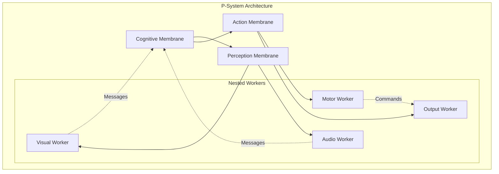
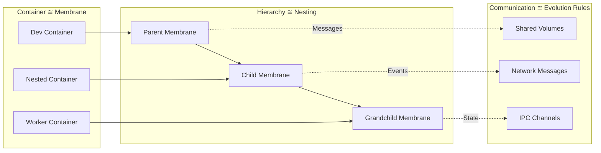
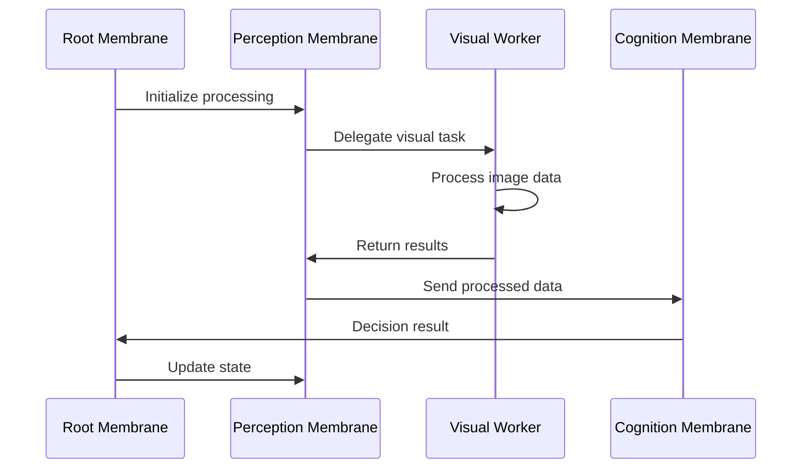
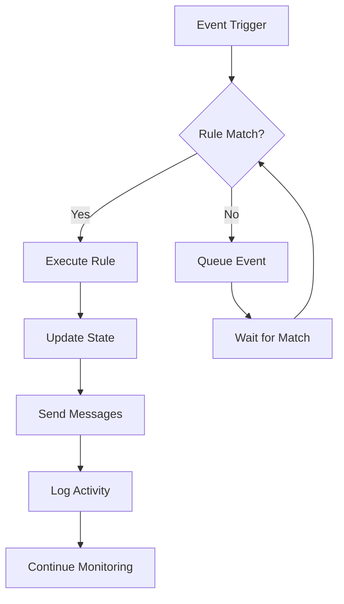
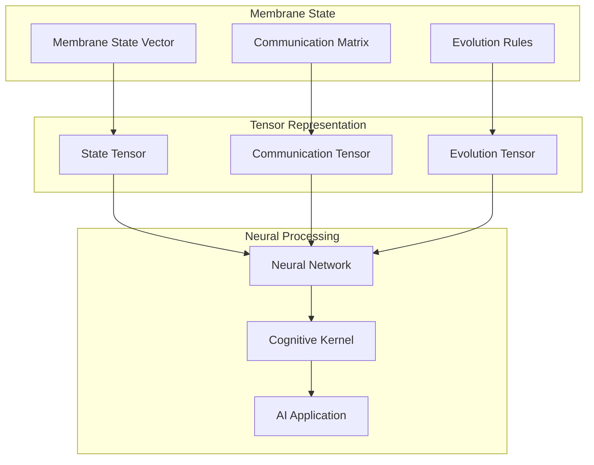

# P-System Membrane Computing Dev Container Features

A revolutionary implementation of **P-System Membrane Computing** as Dev Container Features, enabling containerized environments to function as computational membranes with hierarchical nesting, evolution rules, and inter-membrane communication capabilities.

## 🧬 What is P-System Membrane Computing?

P-Systems (Membrane Systems) are computational models inspired by the structure and functioning of biological cells. This repository implements P-System concepts using modern container technology:



## 🚀 Core Features

This repository provides four specialized dev container features:

### 🧠 `membrane` - P-System Membrane Computing Core

Transforms a dev container into a P-System membrane with evolution rules, communication capabilities, and hierarchical nesting support.

```jsonc
{
    "image": "mcr.microsoft.com/devcontainers/base:ubuntu",
    "features": {
        "ghcr.io/opencoq/devconfeat-p-star/membrane:1": {
            "membraneId": "cognitive-root",
            "enableScheme": true,
            "enableMonitoring": true,
            "communicationMode": "shared-volume"
        }
    }
}
```

**Key Capabilities:**
- 🔄 Evolution rule execution engine
- 📡 Inter-membrane communication protocols  
- 🐣 Scheme-based hypergraph representation
- 📊 Real-time monitoring and event logging
- 🌳 Hierarchical membrane nesting

### 🎼 `orchestrator` - Membrane Hierarchy Management

Orchestrates complex P-System hierarchies using Docker Compose or Kubernetes, with visualization and auto-scaling capabilities.

```jsonc
{
    "image": "mcr.microsoft.com/devcontainers/base:ubuntu",
    "features": {
        "ghcr.io/opencoq/devconfeat-p-star/orchestrator:1": {
            "orchestrationType": "docker-compose",
            "maxNestingDepth": "5",
            "enableVisualization": true,
            "enableAutoScaling": true
        }
    }
}
```

**Key Capabilities:**
- 🐳 Docker Compose and Kubernetes deployment
- 📈 Auto-scaling based on membrane load
- 🎨 Web-based hierarchy visualization
- ⚙️ Configuration generation and management

### 🎨 `color` & 👋 `hello` - Example Features

Simple demonstration features showing basic dev container feature patterns.

```bash
# Test color feature
$ color
my favorite color is green

# Test hello feature  
$ hello
Hello, user.
```

## 🏗️ Architecture Overview

P-System Membrane Computing architecture maps naturally to containerized environments:



### 🧭 System Architecture

```mermaid
architecture-beta
    group cloud(logos:aws-cloudformation)[Cloud Infrastructure]
    group container(logos:docker-icon)[Container Layer]
    group membrane(logos:atom)[Membrane Layer] 
    group application(logos:visual-studio-code)[Application Layer]
    
    service db(logos:postgresql)[Database] in cloud
    service registry(logos:docker-icon)[Container Registry] in cloud
    
    service orchestrator(logos:kubernetes)[Orchestrator] in container
    service runtime(logos:docker-icon)[Container Runtime] in container
    
    service membrane_core(logos:atom)[Membrane Core] in membrane
    service evolution(logos:gear)[Evolution Engine] in membrane
    service communication(logos:signal)[Communication] in membrane
    
    service scheme(logos:scheme)[Scheme Interpreter] in application
    service monitoring(logos:grafana)[Monitoring] in application
    service visualization(logos:d3)[Visualization] in application
    
    orchestrator:R --> L:runtime
    runtime:T --> B:membrane_core
    membrane_core:R --> L:evolution
    evolution:R --> L:communication
    membrane_core:T --> B:scheme
    communication:T --> B:monitoring
    monitoring:R --> L:visualization
    
    db:R --> L:orchestrator
    registry:B --> T:runtime
```



## 🚀 Quick Start

### 1. Basic Membrane Setup

Create a simple P-System membrane:

```bash
# Create devcontainer.json
{
    "image": "mcr.microsoft.com/devcontainers/base:ubuntu",
    "features": {
        "ghcr.io/opencoq/devconfeat-p-star/membrane:1": {
            "membraneId": "my-membrane",
            "enableScheme": true
        }
    }
}

# Open in VS Code
code .
# Container will build with membrane capabilities
```

### 2. Test Membrane Functions

```bash
# Check membrane status
membrane status

# Send test message
membrane send target-membrane "test message"

# View communication logs
membrane log

# Execute evolution rule
./opt/membrane/rules/evolution.sh file_created /tmp/data.json
```

### 3. Deploy Hierarchical System

```bash
# Generate hierarchy configuration
orchestrator generate examples/cognitive-architecture/membrane-hierarchy.json

# Deploy complete system
orchestrator deploy docker-compose.yml

# View visualization
orchestrator visualize
# Open http://localhost:8080
```

## 📊 Communication Flows

### Message Passing Between Membranes



### Evolution Rule Execution



## 🔬 Feature Structure

```
devconfeat-p-star/
├── src/
│   ├── membrane/              # Core P-System membrane
│   │   ├── devcontainer-feature.json
│   │   ├── install.sh
│   │   └── README.md
│   ├── orchestrator/          # Hierarchy orchestration  
│   │   ├── devcontainer-feature.json
│   │   ├── install.sh
│   │   └── README.md
│   ├── color/                 # Example feature
│   └── hello/                 # Example feature
├── examples/
│   └── cognitive-architecture/ # Complete P-System example
├── test/                      # Feature tests
├── TENSOR_MAPPING.md          # ggml integration guide
└── ARCHITECTURE.md            # Detailed technical docs
```

## 🧠 Cognitive Architecture Integration

This system is designed for integration with AI/ML frameworks:

### Tensor Mapping for ggml



See [TENSOR_MAPPING.md](TENSOR_MAPPING.md) for detailed tensor specifications.

## 🚀 Real-World Applications

- **🤖 Cognitive AI Systems**: Hierarchical reasoning with membrane-based attention
- **🔄 Distributed Computing**: Container orchestration with P-System semantics
- **🧪 Computational Biology**: Modeling cellular processes in containers
- **🎮 Game AI**: Multi-level decision making with nested behaviors
- **🏭 Industrial Automation**: Hierarchical control systems with evolution rules

## 📚 Examples

### Basic Cognitive Architecture

See the complete [cognitive-architecture example](examples/cognitive-architecture/) for:
- Multi-level membrane hierarchy
- Inter-membrane communication
- Evolution rule implementation
- Visualization dashboard
- Integration patterns

### Command Reference

```bash
# Membrane commands
membrane status                 # Show membrane state
membrane send <target> <msg>    # Send message
membrane log                    # View communication logs
membrane scheme                 # Enter Scheme REPL

# Orchestrator commands  
orchestrator generate <json>    # Generate configuration
orchestrator deploy <config>    # Deploy hierarchy
orchestrator visualize          # Start visualization
orchestrator status             # Show system status
```

## 🤝 Contributing

We welcome contributions! This project implements cutting-edge computational theory in practical container environments.

### Development Setup

```bash
# Clone repository
git clone https://github.com/OpenCoq/devconfeat-p-star.git
cd devconfeat-p-star

# Test features
./test/run-tests.sh

# Contribute new features or improvements
```

### Adding New Features

1. Create feature directory in `src/`
2. Add `devcontainer-feature.json` and `install.sh`
3. Write tests in `test/`
4. Update documentation

## 📖 Documentation

- **[ARCHITECTURE.md](ARCHITECTURE.md)** - Detailed technical architecture
- **[TENSOR_MAPPING.md](TENSOR_MAPPING.md)** - ggml integration guide
- **[examples/](examples/)** - Complete usage examples
- **[Dev Container Spec](https://containers.dev/)** - Container feature specification

## 📄 License

MIT License - see [LICENSE](LICENSE) for details.

## 🔗 References

- [P-System Theory](https://en.wikipedia.org/wiki/P_system)
- [Membrane Computing](http://ppage.psystems.eu/)
- [Dev Containers](https://containers.dev/)
- [OpenCog Framework](https://opencog.org/)
- [GGML Tensor Library](https://github.com/ggerganov/ggml)

---

*Transform your development environment into a computational membrane with P-System capabilities. Experience the future of distributed, hierarchical computing.*