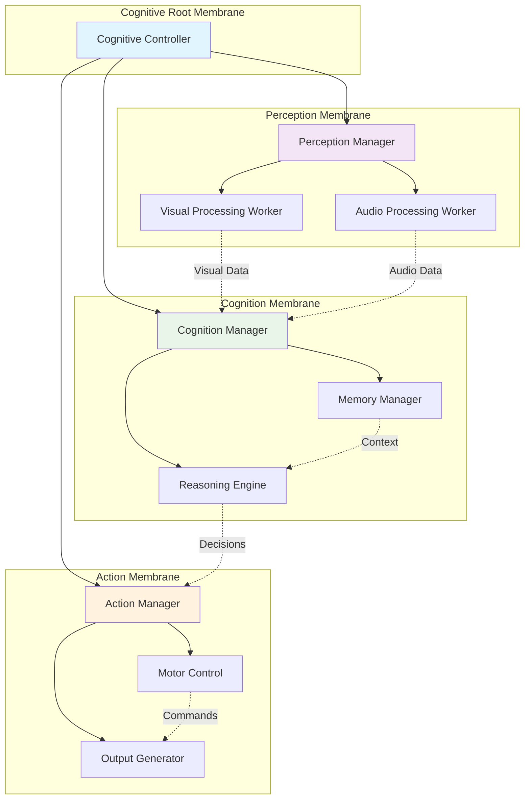
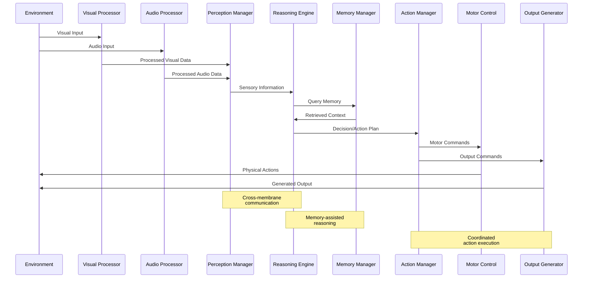
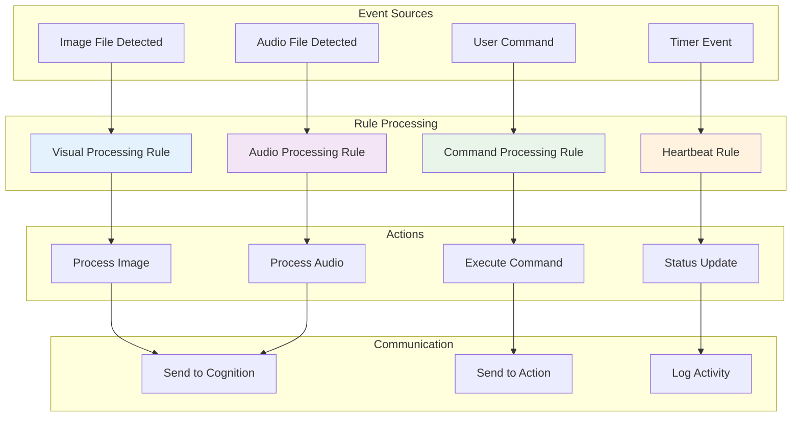

# P-System Membrane Computing Example

This directory contains a complete example demonstrating the P-system membrane computing architecture implemented through dev container features.

## Cognitive Flowchart Implementation

This example implements the cognitive flowchart specified in the original issue:

1. **Dev Container ≅ Membrane**: Each container acts as a P-system membrane
2. **Nested Containers ≅ Nested Membranes**: Hierarchical structure using Docker Compose
3. **Actions ≅ Evolution/Communication Rules**: Container lifecycle hooks and scripts
4. **Hypergraph Representation**: Scheme-based modeling of membrane relationships

## Architecture Overview

This example demonstrates a complete cognitive architecture using P-System membrane computing:



### Membrane Hierarchy Structure

```
Root Membrane (Cognitive Controller)
├── Perception Membrane
│   ├── Visual Processing Worker
│   └── Audio Processing Worker  
├── Cognition Membrane
│   ├── Reasoning Engine
│   └── Memory Manager
└── Action Membrane
    ├── Motor Control
    └── Output Generator
```

### Information Processing Flow



## Files in this Example

- `devcontainer.json` - Main container configuration with both membrane features
- `membrane-hierarchy.json` - P-system hierarchy definition
- `docker-compose.yml` - Generated orchestration configuration
- `scheme-examples/` - Hypergraph representation examples
- `evolution-rules/` - Custom evolution rule scripts
- `README.md` - This documentation

## Quick Start

1. **Open in Dev Container**
   ```bash
   # Clone the repository and open this example folder
   code .
   # Dev container will automatically install membrane features
   ```

2. **Generate Membrane Hierarchy**
   ```bash
   # Generate Docker Compose configuration
   orchestrator generate membrane-hierarchy.json docker-compose.yml
   ```

3. **Deploy P-System**
   ```bash
   # Deploy the complete membrane system
   orchestrator deploy docker-compose.yml
   ```

4. **Start Visualization**
   ```bash
   # Open visualization dashboard
   orchestrator visualize
   # Visit http://localhost:8080
   ```

5. **Test Membrane Communication**
   ```bash
   # Send test message between membranes
   membrane send perception-visual "process-image-data"
   
   # Check membrane status
   membrane status
   
   # View communication logs
   membrane log
   ```

## Membrane Configuration

Each membrane in the hierarchy is configured with specific capabilities:

### Root Membrane (Cognitive Controller)
- **ID**: `cognitive-root`
- **Features**: Full Scheme support, monitoring, orchestration
- **Role**: Coordinates child membranes and handles high-level decision making

### Perception Membrane
- **ID**: `perception`
- **Parent**: `cognitive-root`
- **Features**: Scheme support, specialized sensors
- **Role**: Processes sensory input and forwards to cognition

### Worker Membranes
- **Features**: Lightweight, task-specific processing
- **Communication**: Report results to parent membranes
- **Scaling**: Can be dynamically scaled based on load

## Evolution Rules Examples

## Evolution Rules Examples

The cognitive system includes several pre-configured evolution rules that demonstrate P-System behavior:

### Rule Execution Flow



The system includes several pre-configured evolution rules:

1. **File Processing Rule**
   ```bash
   # Triggered when new data files appear
   # Automatically distributes processing to worker membranes
   ```

2. **Load Balancing Rule**
   ```bash
   # Monitors membrane resource usage
   # Spawns new workers or reassigns tasks as needed
   ```

3. **Communication Flow Rule**
   ```bash
   # Routes messages between membranes based on content type
   # Implements P-system communication protocols
   ```

## Scheme Hypergraph Examples

The system uses Scheme to represent P-system structures:

```scheme
;; Define the cognitive root membrane
(define cognitive-root
  (create-membrane-node "cognitive-root"))

;; Define perception subsystem
(define perception-membrane
  (create-membrane-node "perception"))

;; Create nesting relationship
(define perception-nesting
  (create-nesting-link "perception" "cognitive-root"))

;; Define evolution rule for visual processing
(define visual-evolution
  (create-evolution-rule "perception-visual" 
                        "image-data" 
                        "process-visual.sh"))
```

## Testing the System

Run comprehensive tests to verify P-system behavior:

```bash
# Test individual membrane functionality
membrane status
membrane send test-target "test-message"
membrane log

# Test orchestrator capabilities
orchestrator status
orchestrator examples

# Test evolution rule execution
/opt/membrane/rules/evolution.sh file_created /tmp/test-data.json

# Test Scheme hypergraph representation
membrane scheme
```

## Monitoring and Visualization

The system provides multiple ways to monitor membrane activity:

1. **Web Dashboard**: Visual representation of membrane hierarchy
2. **Command Line**: Real-time status and logging
3. **Event Logs**: Detailed evolution rule execution history
4. **Communication Traces**: Message flow between membranes

## Customization

Extend the system by:

1. **Adding New Membranes**: Update `membrane-hierarchy.json`
2. **Custom Evolution Rules**: Create scripts in `evolution-rules/`
3. **Communication Protocols**: Implement new message types
4. **Visualization**: Extend the web dashboard with custom views

## Integration with OpenCog/AtomSpace

For advanced cognitive architectures, integrate with OpenCog:

```scheme
;; Connect to AtomSpace
(use-modules (opencog))

;; Define membrane as atom
(define membrane-atom
  (ConceptNode "membrane-cognitive-root"))

;; Link to P-system representation
(InheritanceLink
  membrane-atom
  (ConceptNode "P-System-Membrane"))
```

## Tensor Mapping for ggml

The membrane states are designed for future ggml integration:

- **Membrane State Vector**: Configuration, activity, connections
- **Communication Matrix**: Message flow patterns between membranes  
- **Evolution Tensor**: Rule execution patterns and outcomes
- **Hierarchy Embedding**: Nested structure representation

This enables the P-system to be used as input for neural network architectures and cognitive kernel compositions.

## Troubleshooting

Common issues and solutions:

1. **Permission Errors**: Check container user permissions
2. **Communication Failures**: Verify shared volume mounts
3. **Scheme Errors**: Check hypergraph library installation
4. **Orchestrator Issues**: Verify Docker/Kubernetes availability

## Further Reading

- [P-System Theory](https://en.wikipedia.org/wiki/P_system)
- [Membrane Computing](http://ppage.psystems.eu/)
- [Dev Container Specification](https://containers.dev/)
- [OpenCog Framework](https://opencog.org/)
- [GGML Tensor Library](https://github.com/ggerganov/ggml)