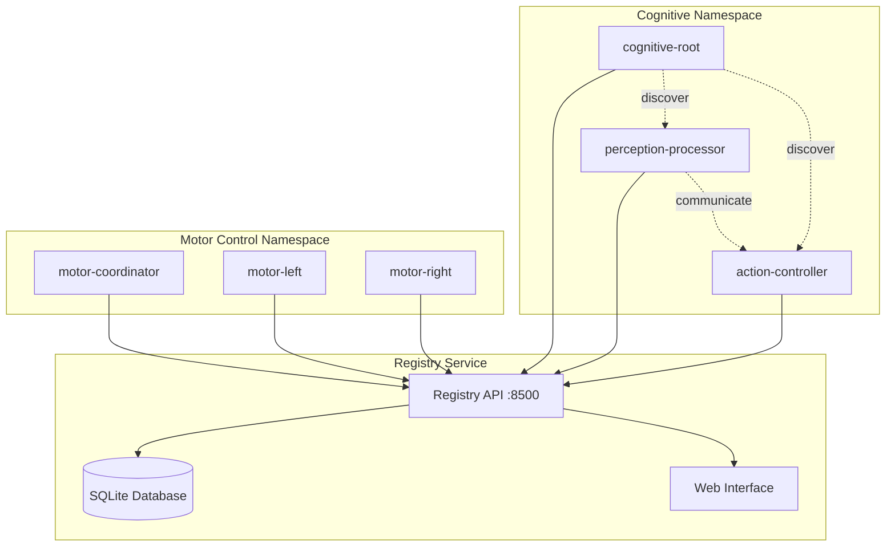

# Distributed Namespace Registration Example

This example demonstrates the distributed namespace registration system for P-System membranes.

## 🎯 Overview

The distributed namespace registration system enables:
- **Dynamic Discovery**: Membranes can find each other without static configuration
- **Service Registration**: Automatic registration with health monitoring  
- **Namespace Isolation**: Logical separation of membrane groups
- **Fault Tolerance**: Stale resource cleanup and heartbeat monitoring
- **Hierarchical Communication**: Parent-child relationships maintained in the namespace

## Architecture

The example creates a multi-level membrane hierarchy:

```
namespace-registry (central registry service)
└── cognitive-root (root membrane)
    ├── perception (perception processing)
    │   ├── visual-worker-1 (visual processing instance 1)
    │   └── visual-worker-2 (visual processing instance 2)
    └── action (action planning)
        └── motor-worker (motor control)
```

## Features Demonstrated

1. **Central Namespace Registry**: Dedicated service for membrane registration and discovery
2. **Auto-Registration**: All membranes automatically register themselves on startup
3. **Dynamic Discovery**: Membranes can discover and communicate with others without static configuration
4. **Hierarchical Communication**: Parent-child relationships maintained in the namespace
5. **Load Distribution**: Multiple visual workers for parallel processing

## 🚀 Quick Start

### 1. Registry-Enabled Environment

```json
{
  "name": "P-System with Distributed Registry",
  "image": "mcr.microsoft.com/devcontainers/base:ubuntu",
  "features": {
    "ghcr.io/opencoq/devconfeat-p-star/registry:1": {
      "registryMode": "standalone",
      "enableServiceDiscovery": true,
      "enableWebUI": true
    },
    "ghcr.io/opencoq/devconfeat-p-star/membrane:1": {
      "membraneId": "cognitive-root",
      "enableRegistry": true,
      "namespaceId": "cognitive-system"
    },
    "ghcr.io/opencoq/devconfeat-p-star/orchestrator:1": {
      "enableRegistry": true,
      "enableVisualization": true
    }
  }
}
```

### 2. Deploy the System

```bash
# Generate Docker Compose configuration
orchestrator generate examples/distributed-namespace/distributed-hierarchy.json docker-compose.yml

# Deploy the membrane hierarchy
orchestrator deploy docker-compose.yml
```

### 3. Start the System

```bash
# 1. Start the registry service
registry start

# 2. Create a namespace for our cognitive system
registry create-namespace "cognitive-system" "AI cognitive architecture"

# 3. Register the current membrane
membrane register

# 4. Check registration status
membrane status

# 5. Discover other membranes in the namespace
membrane discover
```

### 4. Add More Membranes

Create additional containers with different membrane IDs:

```json
{
  "features": {
    "ghcr.io/opencoq/devconfeat-p-star/membrane:1": {
      "membraneId": "perception-processor",
      "parentMembrane": "cognitive-root",
      "enableRegistry": true,
      "namespaceId": "cognitive-system"
    }
  }
}
```

```json
{
  "features": {
    "ghcr.io/opencoq/devconfeat-p-star/membrane:1": {
      "membraneId": "visual-worker",
      "parentMembrane": "perception-processor",
      "enableRegistry": true,
      "namespaceId": "cognitive-system"
    }
  }
}
```

### 5. Interact with the System

```bash
# Check all registered membranes
membrane discover

# Send a message to a specific membrane
membrane send visual-worker "Process image data from camera 1"

# View membrane hierarchy
membrane status

# Monitor activity logs
membrane log
```

## Configuration

The system is configured through `distributed-hierarchy.json`:

- **Namespace Registry**: Dedicated container running the registry service
- **Membrane Hierarchy**: 6 membranes in a 3-level hierarchy
- **Communication Mode**: Shared volume with namespace resolution
- **Monitoring**: Enabled on all membranes for observability

## Advanced Features

### Registry Web Interface

Access the registry's web interface at `http://localhost:8765` to:
- View all registered membranes
- Monitor health status
- Visualize membrane hierarchy
- Debug communication issues

### Distributed Deployment

Deploy across multiple hosts:

```bash
# Host 1: Registry + Root membrane
docker-compose -f registry.yml up -d

# Host 2: Perception membranes
docker-compose -f perception.yml up -d

# Host 3: Action membranes  
docker-compose -f action.yml up -d
```

### Fault Tolerance

The system handles:
- **Registry Failures**: Membranes cache discovered information
- **Membrane Failures**: Automatic cleanup of stale registrations
- **Network Partitions**: Graceful degradation and reconnection

## Monitoring and Debugging

```bash
# Check registry health
curl http://localhost:8765/status

# View all registered membranes
curl http://localhost:8765/api/membranes

# Monitor membrane events
membrane log | grep registry

# Debug communication
membrane send --debug visual-worker "test message"
```

This example demonstrates how P-System membranes can form dynamic, distributed computing systems with automatic discovery and fault tolerance.

### 6. Dynamic Orchestration

```bash
# Discover and generate Docker Compose from registry
orchestrator discover

# Deploy discovered membranes automatically
orchestrator deploy-from-registry

# Generate Kubernetes manifests from registry
orchestrator kubernetes-from-registry http://localhost:8500 cognitive-system k8s-deployment.yml
```

## 🔍 Discovery and Communication

### Membrane Discovery

```bash
# Discover all membranes in namespace
membrane discover

# Expected output:
{
  "membranes": [
    {
      "membrane_id": "cognitive-root",
      "namespace_name": "cognitive-system", 
      "host": "192.168.1.100",
      "status": "active",
      "capabilities": ["p-system", "membrane-computing"]
    },
    {
      "membrane_id": "perception-processor",
      "parent_membrane": "cognitive-root",
      "namespace_name": "cognitive-system",
      "host": "192.168.1.101", 
      "status": "active"
    }
  ]
}
```

### Registry Management

```bash
# Check registry health
registry status

# View statistics  
registry stats

# List all namespaces
registry namespaces

# Create new namespace
registry create-namespace "motor-control" "Motor control subsystem"
```

### Web Interface

Visit `http://localhost:8500` to see the web-based registry management interface with:
- Real-time membrane status
- Namespace management
- System statistics
- Membrane hierarchy visualization

## 📊 Monitoring and Health

### Automatic Health Monitoring

The system provides automatic:
- **Heartbeat Monitoring**: Membranes send heartbeats every 30 seconds
- **Stale Detection**: Inactive membranes marked as stale after 5 minutes
- **Auto-cleanup**: Stale resources automatically removed
- **Status Tracking**: Real-time status updates

### Manual Health Checks

```bash
# Send manual heartbeat
membrane heartbeat

# Check specific membrane status
curl http://localhost:8500/api/membranes/discover?namespace_id=cognitive-system

# View registry logs
tail -f /opt/registry/logs/*.log
```

## 🏗️ Architecture Diagram



## 🔧 Configuration Options

### Registry Configuration

```json
{
  "registryMode": "standalone",        // standalone | distributed | etcd-backend
  "enableServiceDiscovery": true,     // Enable discovery API
  "enableHealthChecking": true,       // Enable health monitoring
  "registryPort": "8500",             // Service port
  "enableWebUI": true                 // Enable web interface
}
```

### Membrane Configuration

```json
{
  "membraneId": "cognitive-root",     // Unique membrane identifier
  "enableRegistry": true,             // Enable registry integration
  "registryUrl": "http://localhost:8500",  // Registry service URL
  "namespaceId": "cognitive-system"   // Target namespace
}
```

### Orchestrator Configuration

```json
{
  "enableRegistry": true,             // Enable registry integration
  "registryUrl": "http://localhost:8500"  // Registry service URL
}
```

## 🧪 Testing the Integration

### Basic Functionality Test

```bash
#!/bin/bash
set -e

# Start registry
registry start &
sleep 3

# Create test namespace
registry create-namespace "test-system" "Test namespace"

# Register membrane
membrane register

# Verify registration
if membrane discover | grep -q "test-system"; then
    echo "✅ Registration successful"
else
    echo "❌ Registration failed" 
    exit 1
fi

# Test heartbeat
membrane heartbeat
echo "✅ Heartbeat test passed"

# Test discovery
orchestrator discover
echo "✅ Discovery test passed"

echo "🎉 All tests passed!"
```

### Load Testing

```bash
# Create multiple test membranes
for i in {1..10}; do
    MEMBRANE_ID="test-membrane-$i" membrane register &
done
wait

# Verify all registered
registry stats
```

## 🔗 Integration Points

### With Existing Features

- **Membrane Feature**: Auto-registration and discovery capabilities
- **Orchestrator Feature**: Dynamic deployment from registry
- **Cognitive Architecture**: Service discovery for AI components

### With External Systems

- **Kubernetes**: Automatic manifest generation
- **Docker Compose**: Dynamic service orchestration  
- **Monitoring Systems**: Health check endpoints
- **Load Balancers**: Service discovery integration

## 📚 Additional Resources

- [Registry API Documentation](../registry/README.md)
- [Membrane Registry Integration](../membrane/README.md)
- [Orchestrator Registry Commands](../orchestrator/README.md)
- [P-System Architecture](../../ARCHITECTURE.md)

## 🤝 Contributing

To extend the distributed namespace registration:

1. **Add New Backend**: Implement etcd or Consul backend for the registry
2. **Enhanced Discovery**: Add filtering and search capabilities
3. **Security**: Add authentication and authorization
4. **Monitoring**: Integrate with Prometheus/Grafana
5. **Scaling**: Add clustering and replication

The system is designed to be modular and extensible for future enhancements.
