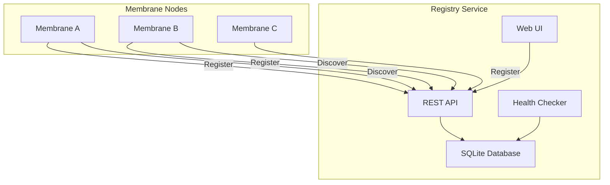

# P-System Distributed Namespace Registry

The P-System Distributed Namespace Registry enables dynamic discovery and registration of membranes across distributed P-System deployments.

## 🔗 Features

- **Distributed Service Discovery**: Register and discover membranes across multiple nodes
- **Namespace Management**: Organize membranes into logical namespaces  
- **Health Monitoring**: Automatic health checking and stale resource cleanup
- **REST API**: Full REST API for programmatic access
- **Web UI**: Browser-based management interface
- **Multiple Backends**: Support for standalone, distributed, and etcd backends

## 🚀 Quick Start

### Basic Registry Setup

```json
{
    "image": "mcr.microsoft.com/devcontainers/base:ubuntu",
    "features": {
        "ghcr.io/opencoq/devconfeat-p-star/registry:1": {
            "registryMode": "standalone",
            "enableServiceDiscovery": true,
            "enableWebUI": true
        }
    }
}
```

### Commands

```bash
# Start the registry service
registry start

# Check registry health
registry status

# Create a namespace
registry create-namespace "cognitive-system" "AI cognitive architecture"

# View registry statistics
registry stats

# Discover registered membranes
registry discover
```

## 📡 API Endpoints

### Namespaces
- `POST /api/namespaces` - Create namespace
- `GET /api/namespaces` - List namespaces

### Membranes
- `POST /api/membranes/register` - Register membrane
- `GET /api/membranes/discover` - Discover membranes
- `POST /api/membranes/{id}/heartbeat` - Update heartbeat

### System
- `GET /health` - Health check
- `GET /api/stats` - Registry statistics

## 🏗️ Architecture



## 🔧 Configuration Options

- **registryMode**: `standalone` | `distributed` | `etcd-backend`
- **enableServiceDiscovery**: Enable discovery capabilities
- **enableHealthChecking**: Enable health monitoring
- **registryPort**: Service port (default: 8500)
- **enableWebUI**: Enable web interface

## 🧪 Example Usage

### Register a Membrane

```bash
curl -X POST http://localhost:8500/api/membranes/register \
  -H "Content-Type: application/json" \
  -d '{
    "namespace_id": "default", 
    "membrane_id": "cognitive-root",
    "host": "192.168.1.100",
    "port": 8080,
    "capabilities": ["scheme", "monitoring"]
  }'
```

### Discover Membranes

```bash
curl http://localhost:8500/api/membranes/discover?namespace_id=default
```

## 🔗 Integration

The registry integrates seamlessly with:
- **Membrane Feature**: Auto-registration and discovery
- **Orchestrator Feature**: Dynamic service management
- **External Services**: REST API for third-party integration

## 📊 Monitoring

The registry provides:
- Real-time membrane status tracking
- Automatic stale resource cleanup
- Health check endpoints
- Statistics and metrics
- Web-based dashboard

Visit `http://localhost:8500` for the web interface when `enableWebUI` is enabled.